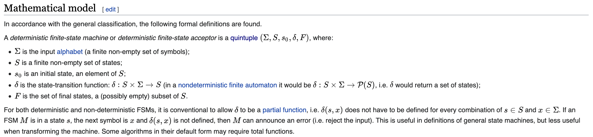

# State Driven UIs

# Intro

[Inspiration](https://slides.com/davidkhourshid/finite-state-machines)

When we are building out UIs the biggest area of issue is our users doing totally unexpected things (Edge Cases). We try to solve for this with QA doing their best to break it; putting in letters where there should be numbers, clicking on things and typing in boxes like they're trying to execute a special move in Mortal Kombat. And why is this such an issue? Because it is impossible to forsee all of the possible states the app can be in, and users some how find a way to arrive at the most obscure ones. And, if we don't know about these states we can't code for them! 

What can we do?

Enter State Driven UIs!


## Benefits

1. Reduce implementation bugs
2. Faster iteration
3. Separation of concerns
4. Common language with designers
5. Easy testing
6. Self documenting


# Example:

To see the examples just copy this directory somewhere and open the html files in some browser.

Let's compare some different feature development implmentations to understand what State Driven UIs can solve.

Let's say that you are developing a feature to search for and display images of dogs. You get a design from the UX person which has a simple button to initiate the search, and then displays a grid of dog images. Simple enough right?


# Event Driven UI

A typical implementation of this feature might look something like this.

[Example](./event-driven/v1.html)

We have a component with a button and an event handler. On click of the button we use the event handler to make a request to get our photos and then set them.

So what's the issue with this?

Well there are a few things that we haven't considered.

* What if the search fails? Error message?
* What if the search is taking awhile? Loading message?
* What if the user starts mashing the button? Disable additional Searches?

These are just some immediate concerns, but there are likely many more to consider. Ok so you go back to the UX person and express your concern and finally settle on a new design. One that includes all of those things listed above. Easy enough to update.

[Example](./event-driven/v2.html)

Now let's analyze our finished product.

What are we really trying to represent here. Our app has 4 possible scenarios. 

First, the user has not tried to load anything. 

Second, the user has clicked the button and is now waiting for the photos to load. 

Third, the fetch was successful and the user can view the photos. 

Fourth, the fetch was unsuccessful and the user can retry and is alerted that there was something wrong.

How accurately does our component represent these different scenarios? Well it turns out with this implementation it's possible for our component to be in the error and fetching state at the same time. Even the success and error state at the same time! In fact there are 8 different combinations that this component can exist in, which seems like A LOT for such a simple feature. 

*This is because all of the business logic is contained within our single event handler.*

This is an issue because as the requirements for the feature get more complex, so will the logic of the handler. This also means that the possible states the handler must keep track of also increases. This makes enhancement much more difficult as any modification opens the handler up to regression. It also means that the likelihood of implementation bugs existing goes up! Even testing becomes more tricky because any action has so many different results!

From a coding perspective this implementation has another issue. The business logic is entagled with the rendering logic. What should be displayed is mixed with how to display it. This means that any change to business logic of what to display in the app has the potential to change the actual display of those things. This is an issue as some simple change could totally break the page visual! Also you are locking yourself into some specific UI implementation, some framework, unless you want to rewrite all of the business logic in a new one. Too bad if you chose AngularJS... 😛 A better implementation would be to separate the logic of what to display from how.

TLDR on this implementation. It focuses on the EVENT. Inside that event, we check some state to understand what we should do. If there are issues, we just add more conditions to that event until we've covered every edge case.


# State Driven UI

So let's try to refactor this feature in a stateful approach!

[Example](./state-driven/v1.html)

Since we know exactly what states our application can exist in, let's code for those first and consider the events second!

```
    idle
    fetching
    success
    error
```

Here we are using a package called [XState](https://xstate.js.org/docs/) to do our state management. You can see this implementation at the top. Here we define all the possible states this feature can exist in. Inside of them we define the events that are relevant to those states and the state movement as a result of those events. If an event is raised but is not relevant to a state, it simply passes like a ship in the night!

So why is this better?

First we have named states. We do not need to maintain a complicated list of boolean combinations to understand what state the feature is in. This makes it much easier to identify the relevant code!

Second we know exactly what can happen on each state. Remember above when we were considering all the edge cases the app could exist in and we identified 8 possibilities? In the event handler we had to consider what would happen in an action under each given one. Well here we know we have exactly 4, and we also define exactly what happens for an action on each. This means that we can say with confidence what code will execute, and what the result will be for any given action *even if it is the same action! (Event handler calls the same thing no matter what)*. Additionally, because each state is isolated, you don't even have to think about the other states when you are designing a new one or editing an existing one. This makes development much easier!

Third we have a proper seperation of concerns. This allows our render logic to be more declarative and deal only with the rendering. Look at the simplicity of the button text in this implementation in comparison to the previous. *I'm sure we've all seen some pretty wacky ternaries!* Plus, if we wanted to swap in a new framework, or create a more native (React Native?) version of this app, we can still use that same business logic no problem! All we need to do is make the render functions in the new framework.

Fourth the test cases practically write themselves. What are all the given scenarios we should look at? Well, what are all the given states and actions listed for them? That's it. The app can't exist in any other one! This means that we don't need to be as concerned with the edge cases as before. We don't need to ask what if questions, we can just look at the code and know what will happen. 

Fifth we are also thinking about the app the same way as a UX designer. They think in user flows. The state definition is a code representation of a user flow! This allows us to directly translate their vision into code with little interpretation. We can even use the same language so that when discussing the feature, we know exactly what terms point to what sections of code!

Sixth this makes iteration much faster. Considering all the points made previously, iteration and enhancement becomes no big deal. Because states are named and isolated, adding or changing functionality becomes easy and predictable.


# Final Thoughts

Here we illustrated a specific state management implementation of a feature and the benefits we might gleam from using this pattern. The point is not to say that [XState](https://xstate.js.org/docs/) makes your code better, but rather this way of thinking does. Instead of thinking of the state as a side effect of actions that occur within your UI, you should consider it as the starting point. This puts you on offense when it comes to coding out a feature as opposed to on defense. You don't need a ton of case statements within some handler to dictate the app flow or be at the mercy to insane user flow possibilities, but instead can define the desired user flows and relevant actions right on the state. This makes your code more declarative, readable, predictable, and open for modification.


# What Next?

Ok so let's say you want to try this out, but you don't want to learn a whole new library or can't bring it into an existing project. No problem! The concept is relatively simple. A deterministic finite state machine is just a quintuple

(A, S, S0, T, F) where:

A - is the input alphabet (finite, non empty)

S - is a set of states (finite, non empty)

S0 - initial state (element of S)

T - transition map S x A -> S

F - set of final states (possibly empty)



You can easily define a simple one like so:
```js
class StateMachine {
  constructor (A, S, S0, T, F) {
    this.A = A
    this.S = S
    this.S0 = S0
    this.T = T
    this.F = F
  }

  get initialState () {
    return this.S0
  }

  transition (state, input) {
    return this.T[state][input] || state
  }
}
```

[Example](./simple-state-machine/index.html)
